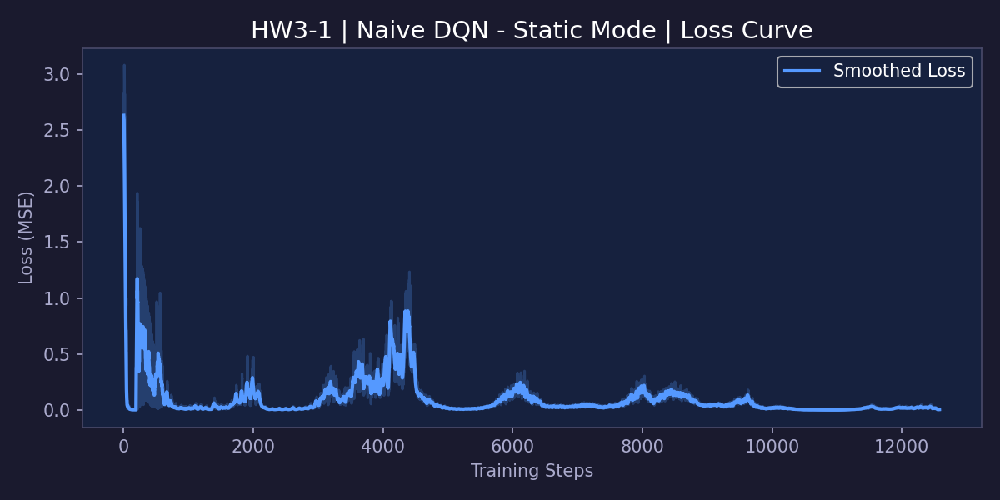
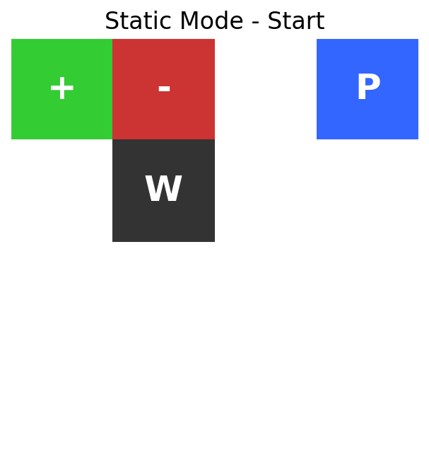
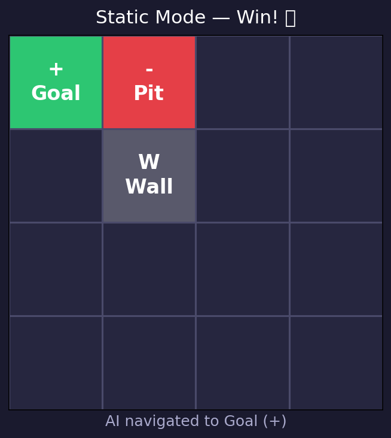
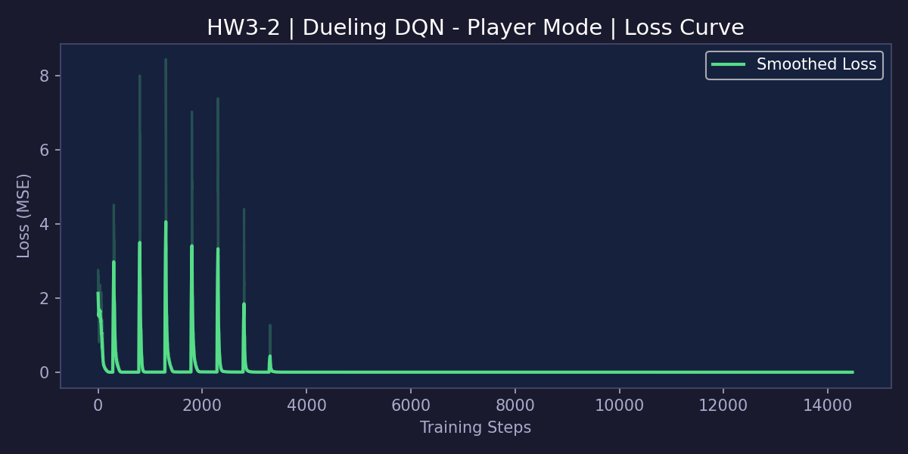
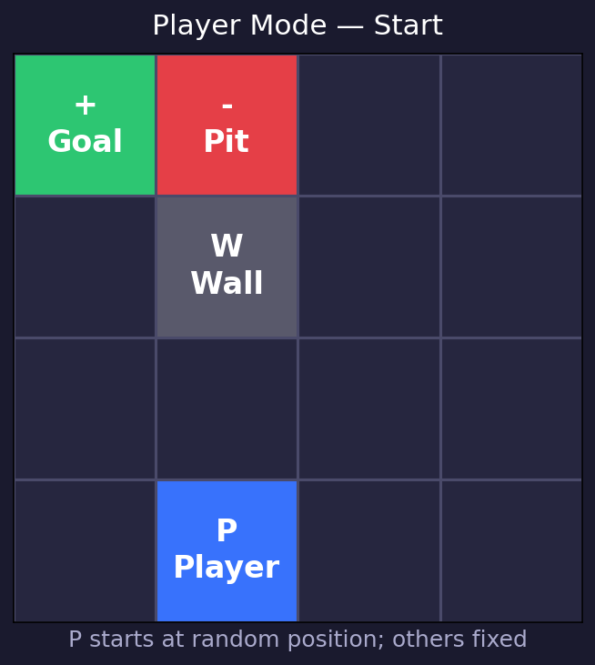
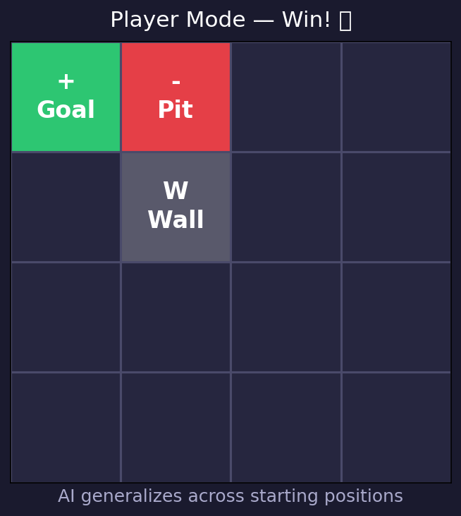
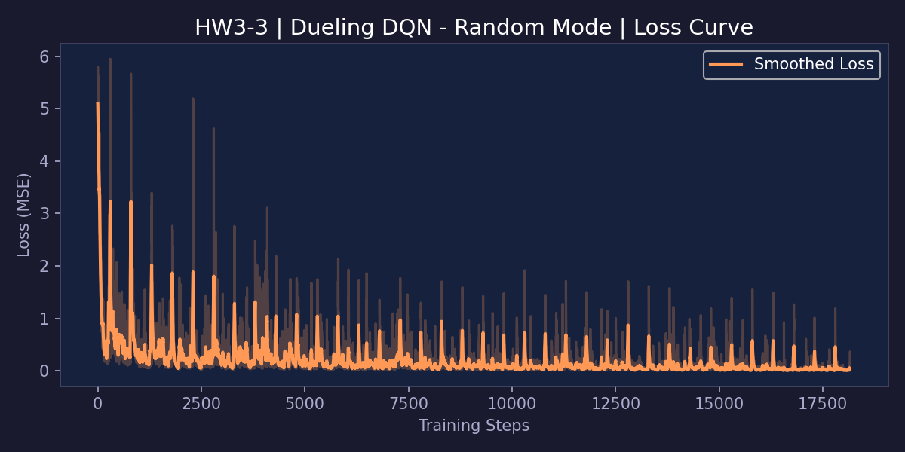
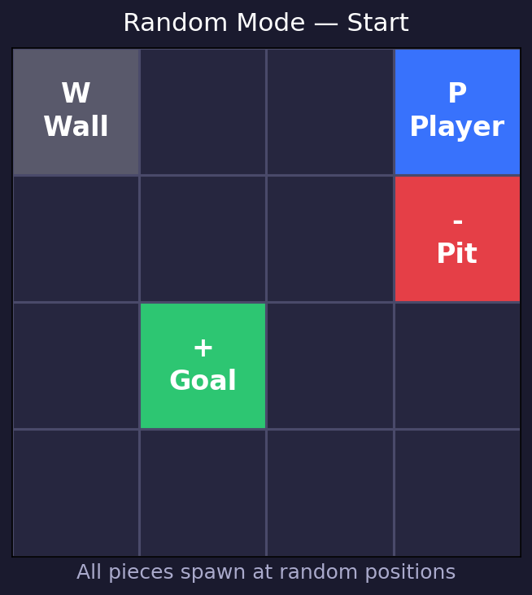
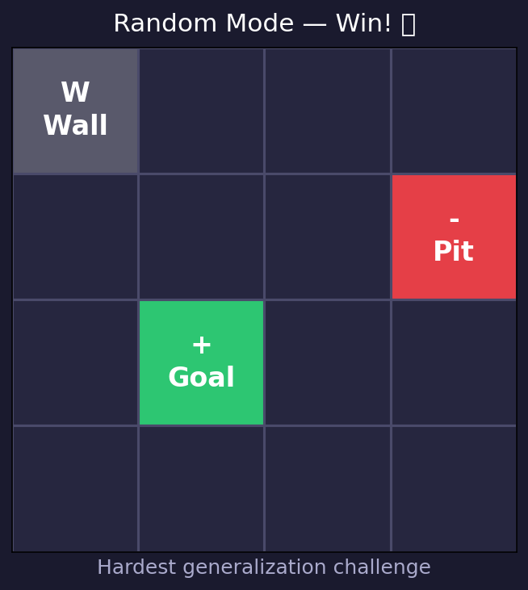

# 📘 HW3: DQN and its variants

**深度強化學習 HW3 | Progressive DQN Engineering Report**

> 採用 **tf.keras + GradientTape** 自訂訓練迴圈（無 `model.fit()`），在 Gridworld 三個難度模式中逐步遞進加入 DQN 機制 **S1 → S5**。

---

## 📌 環境說明

| 符號 | 名稱 | 獎勵 |
|:---:|:---:|:---|
| `P` | Player | AI 控制的玩家 |
| `+` | Goal | 抵達 → **+10** 獲勝 |
| `-` | Pit | 踩到 → **-10** 失敗 |
| `W` | Wall | 無法穿越 |
| ` ` | Empty | 每步 **-1** |

---

## 🧠 Stage 1 — Static Mode (HW3-1, 30%)

**腳本：`hw3_1_static_keras.py`　｜　機制：S1 Replay Buffer + S2 Target Network**

### 環境難度分析
所有物件位置**永遠固定**（Player 在 (0,3)、Goal 在 (0,0)），難度最低。AI 只需記住一條固定路徑。

### 問題症狀 → 選擇機制

| 症狀 | 解決方案 | 代號 |
|:---|:---|:---:|
| 連續步驟高度相關，導致災難性遺忘 | 隨機取樣打破時間相關性 | **S1** Replay Buffer |
| TD 目標隨網路同步更新，造成訓練發散 | 凍結目標網路一段時間 | **S2** Target Network |
| — | S3/S4/S5 過度設計，靜態模式不需要 | ❌ 跳過 |

### 訓練 Loss 曲線

<p align="center">
  
</p>

### 實際通關截圖

<p align="center">
  <strong>初始狀態（固定佈局）</strong>
  &nbsp;&nbsp;&nbsp;&nbsp;&nbsp;&nbsp;&nbsp;&nbsp;&nbsp;&nbsp;&nbsp;&nbsp;&nbsp;&nbsp;&nbsp;&nbsp;&nbsp;&nbsp;&nbsp;&nbsp;&nbsp;&nbsp;&nbsp;&nbsp;
  <strong>最終狀態</strong>
</p>
<p align="center">
  
  &nbsp;&nbsp;&nbsp;➡️&nbsp;&nbsp;&nbsp;
  
</p>

---

## ⚖️ Stage 2 — Player Mode (HW3-2, 40%)

**腳本：`hw3_2_player_keras.py`　｜　機制：繼承 S1+S2，新增 S3 Double DQN + S4 Dueling DQN**

### 環境難度分析
Player 初始位置**隨機**，其餘固定。AI 必須從任意起點學會路徑規劃（策略泛化）。

### 問題症狀 → 選擇機制

| 症狀 | 解決方案 | 代號 |
|:---|:---|:---:|
| Q 值被系統性高估（同一網路選擇又評估）→ 發散 | Online 選動作、Target 評估價值 | **S3** Double DQN |
| 遠離物件時 4 個動作 Q 值幾乎相等，學習慢 | 分離 V(s) 與 A(s,a) 兩條輸出流 | **S4** Dueling DQN |
| — | S5 PER：Player 模式轉移足夠多樣，均勻採樣無嚴重問題 | ❌ 跳過 |

**Dueling DQN 架構：**

```
Input(64) → Dense(150,relu)
                │
        ┌───────┴────────┐
  Dense(100) relu   Dense(100) relu
  Dense(1)            Dense(4)
    V(s)               A(s,a)
        └───────┬────────┘
    Q(s,a) = V(s) + A(s,a) - mean(A)
```

### 訓練 Loss 曲線

<p align="center">
  
</p>

### 實際通關截圖

<p align="center">
  <strong>初始狀態（玩家隨機位置）</strong>
  &nbsp;&nbsp;&nbsp;&nbsp;&nbsp;&nbsp;&nbsp;&nbsp;&nbsp;&nbsp;&nbsp;&nbsp;&nbsp;&nbsp;&nbsp;&nbsp;&nbsp;&nbsp;
  <strong>最終狀態</strong>
</p>
<p align="center">
  
  &nbsp;&nbsp;&nbsp;➡️&nbsp;&nbsp;&nbsp;
  
</p>

---

## 🔁 Stage 3 — Random Mode (HW3-3, 30%)

**腳本：`hw3_3_random_keras.py`　｜　機制：繼承 S1~S4，新增 S5 PER + Grad Clipping + LR Scheduling**

### 環境難度分析
**全部物件隨機**（Player、Goal、Pit、Wall）。AI 無法依賴佈局記憶，必須學到真正通用的策略（「藍色往綠色走、避開紅色」）。

### 問題症狀 → 選擇機制

| 症狀 | 解決方案 | 代號 |
|:---|:---|:---:|
| Replay Buffer 被 −1 獎勵轉移淹沒，+10/−10 關鍵經驗稀少被稀釋 | 優先回放高 TD-error 的轉移 | **S5** PER |
| 未見過的隨機棋局產生超大 TD 誤差，一次更新破壞整個網路 | 限制梯度向量範數 ≤ 1.0 | Gradient Clipping |
| 後期固定學習率使策略在最佳解附近震盪 | 指數衰減學習率（每 1000 步 × 0.995） | LR Scheduling |

### 訓練 Loss 曲線

<p align="center">
  
</p>

### 實際通關截圖

<p align="center">
  <strong>初始狀態（全部隨機）</strong>
  &nbsp;&nbsp;&nbsp;&nbsp;&nbsp;&nbsp;&nbsp;&nbsp;&nbsp;&nbsp;&nbsp;&nbsp;&nbsp;&nbsp;&nbsp;&nbsp;&nbsp;&nbsp;&nbsp;&nbsp;&nbsp;&nbsp;&nbsp;&nbsp;
  <strong>最終狀態</strong>
</p>
<p align="center">
  
  &nbsp;&nbsp;&nbsp;➡️&nbsp;&nbsp;&nbsp;
  
</p>

---

## 📊 三階段漸進設計總覽

```
Stage 1 — Static          Stage 2 — Player          Stage 3 — Random
─────────────────         ─────────────────         ─────────────────
S1 Replay Buffer    ─────► (inherited)        ─────► (inherited)
S2 Target Network   ─────► (inherited)        ─────► (inherited)
                         S3 Double DQN        ─────► (inherited)
                         S4 Dueling DQN       ─────► (inherited)
                                                   S5 PER
                                                   Gradient Clipping
                                                   LR Scheduling
```

| | Stage 1 Static | Stage 2 Player | Stage 3 Random |
|:---:|:---:|:---:|:---:|
| 難度 | ⭐ | ⭐⭐⭐ | ⭐⭐⭐⭐⭐ |
| 新症狀 | 遺忘 + TD 漂移 | Q 值高估 + 學習慢 | 稀疏獎勵 + 梯度爆炸 |
| 新增機制 | S1 + S2 | S3 + S4 | S5 + Clip + LR |
| 框架 | tf.keras + GradientTape | tf.keras + GradientTape | tf.keras + GradientTape |

---

## 🚀 如何執行

```bash
# 安裝依賴
pip install numpy torch pytorch-lightning matplotlib

# 三個階段分別執行
python hw3_1_static_keras.py
python hw3_2_player_keras.py
python hw3_3_random_keras.py

# 終端機動畫 Demo
python demo.py
```
