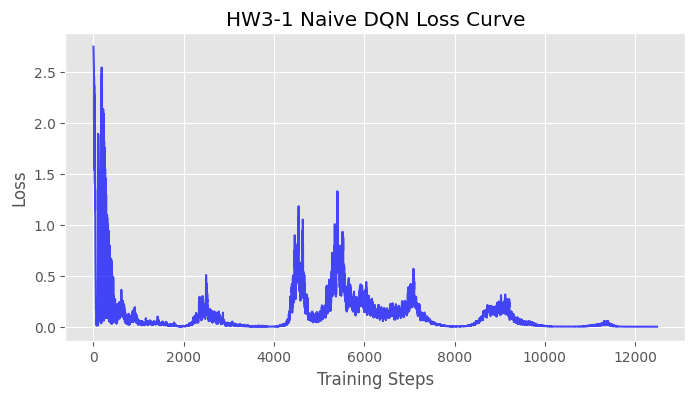
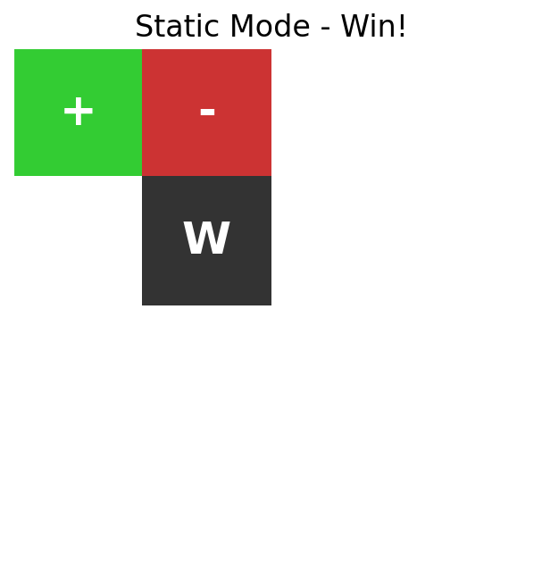
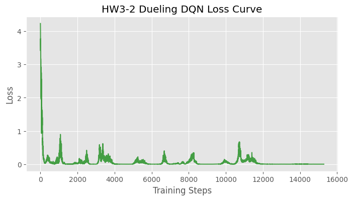

# 📘 Homework 3: DQN and its variants
**深度強化學習 HW3 學習與實作報告**

這份作業我們針對 Gridworld 環境，從零開始實作了最基礎的 Naive DQN，並逐步升級成 Double DQN 與 Dueling DQN 變體，最後為了穩定最難的隨機模式，更進一步將架構轉換為 PyTorch Lightning，並加入了梯度裁剪 (Gradient Clipping) 與學習率調度 (LR Scheduling) 等訓練技巧。

---

## 📂 1. Setup & Reference
我們使用了參考來源的 `GridBoard.py` 與 `Gridworld.py` 作為環境。遊戲的基本規則如下：
- **P (Player, 藍色)**：玩家，可以上下左右移動。
- **+ (Goal, 綠色)**：目標位置，碰到可得 +10 分，遊戲獲勝結束。
- **- (Pit, 紅色)**：陷阱位置，碰到扣 -10 分，遊戲失敗結束。
- **W (Wall, 黑色)**：牆壁，無法穿透。
- 每走一步會受到 -1 分的懲罰，鼓勵 AI 找出最短路徑。

---

## 🧠 2. HW3-1: Naive DQN (Static Mode) [30%]
### 實作概念與程式碼架構
在這個難度（靜態模式）下，地圖的物件位置永遠固定不變。我們撰寫了 `hw3_1_naive_dqn.py`。
- **網路架構**：使用三個線性層 (Linear Layers)，輸入為 64 維的拉平向量 (4x4x4)，經過 150 與 100 的隱藏層 (搭配 ReLU 激活函數)，最後輸出 4 個動作的 Q-Value。
- **Experience Replay Buffer (經驗回放池)**：這是一個能大幅提升訓練穩定度的機制。我們將 AI 每次移動產生的 `(狀態, 動作, 回饋, 新狀態, 是否結束)` 存入一個 `deque` 佇列中。
  - **功用與理解**：因為強化學習中「連續動作產生的狀態」是高度相關的（例如站在原地往左走，和往右走的狀態畫面極度相似），如果直接拿連續資料訓練，神經網路很容易陷入「災難性遺忘」，也就是只記得最近幾步怎麼走。透過 Experience Replay 將資料存起來後再**隨機抽取 (Random Sample)**，能打破時間相關性，並讓過去的經驗能被重複利用，大幅提升樣本效率 (Sample Efficiency)。

### 訓練成果與實際截圖
<p align="center">
  
</p>
從 Loss 曲線可以看出，隨著經驗的累積，網路的 Loss 逐漸收斂。以下是 AI 在 Static 模式中實際通關的視覺截圖：

<p align="center">
  
  ➡️ 
  
</p>

---

## ⚖️ 3. HW3-2: Enhanced DQN Variants (Player Mode) [40%]
在這個模式下，玩家的初始位置會隨機出現，難度提升。我們實作了以下兩種變體來比較它們對基礎 DQN 的改進：

### A. Double DQN (`hw3_2_double_dqn.py`)
- **傳統 DQN 的痛點**：在計算 目標 Q 值 (Target Q-value) 時，傳統 DQN 會使用同一個網路來「挑選最大 Q 值的動作」並且「評估該動作的價值」。這很容易導致某些動作的價值剛好被高估，進而讓網路不斷往錯誤的方向更新（過度估計 Overestimation Bias）。
- **改善方式**：Double DQN 引入了兩個網路 (Online Network 與 Target Network)。我們用 Online Network 來選擇下一個狀態最佳的動作，然後交由 Target Network 來評估這個動作的真正價值。這樣的「選擇與評估分離」有效避免了高估問題，讓價值函數更加精準。

### B. Dueling DQN (`hw3_2_dueling_dqn.py`)
- **傳統 DQN 的痛點**：DQN 會對每一種「狀態-動作」給出一個分數。但在某些狀態下（例如周圍沒有陷阱，只是單純在空地移動），不管選哪個動作，後續的價值其實都差不多。此時強迫網路去學習每一個特定動作的精準 Q 值是浪費且效率低下的。
- **改善方式**：Dueling DQN 改變了網路架構的後半段，將輸出分流為兩條路徑：
  1. **Value Stream $V(s)$**：單純評估「這個狀態本身有多好」。
  2. **Advantage Stream $A(s, a)$**：評估「選擇某個動作比平均動作好多少」。
- **結合公式**：$Q(s,a) = V(s) + A(s,a) - \text{mean}(A(s,a))$。這種設計讓神經網路可以更頻繁地更新狀態價值 $V(s)$，在複雜環境（特別是動作選擇影響不大的狀態）下能顯著加速學習。

### 訓練成果與實際截圖 (Dueling DQN)
<p align="center">
  
</p>
<p align="center">
  
  ➡️ 
  
</p>

---

## 🔁 4. HW3-3: Enhance DQN for Random Mode WITH Training Tips [30%]
隨機模式下，所有物件（包含終點、陷阱、牆壁）的位置都是隨機生成的，這是難度最高的任務。為了應對這個挑戰，我們重構了程式碼，將模型轉換為工業級標準的 **PyTorch Lightning** 架構。

### 執行腳本：`hw3_3_lightning_dqn.py`
- **框架優勢 (PyTorch Lightning)**：將凌亂的 `while` 迴圈封裝成了 `training_step`，我們更實作了自訂的 `IterableDataset` 來優雅地處理 Replay Buffer 資料流。這不僅讓程式碼結構更清晰，也更容易擴充。
- **訓練穩定性優化 (Bonus Training Tips)**：
  1. **Gradient Clipping (梯度裁剪)**：在 `pl.Trainer` 參數中加入了 `gradient_clip_val=1.0`。在隨機模式下，AI 很容易遇到從未見過的極端狀態，產生過大的 Loss 導致「梯度爆炸」。梯度裁剪能限制反向傳播的步長，保證權重更新的穩定性。
  2. **LR Scheduling (學習率調度)**：在 `configure_optimizers` 中加入了 `torch.optim.lr_scheduler.StepLR`。這能讓學習率在訓練中後期自動衰減 (乘以 0.9)，幫助模型在接近最佳解時，以更細微的步伐進行收斂。

### 實際截圖 (Random Mode)
<p align="center">
  
</p>

---

## 🎮 如何親自執行與體驗？
若想要親眼看到 AI 一步步在你的終端機裡移動，我為你寫了一支包含動畫播放效果的 Demo 腳本。
執行指令：
```bash
python demo.py
```
*(程式會先在背景訓練幾秒鐘，接著將會在終端機以動畫的方式顯示 AI 走迷宮的決策過程！)*
